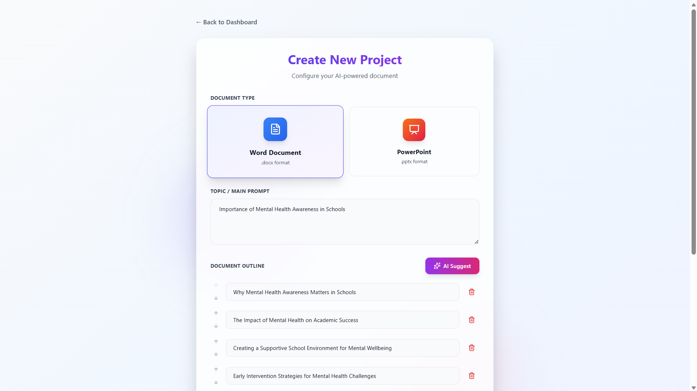
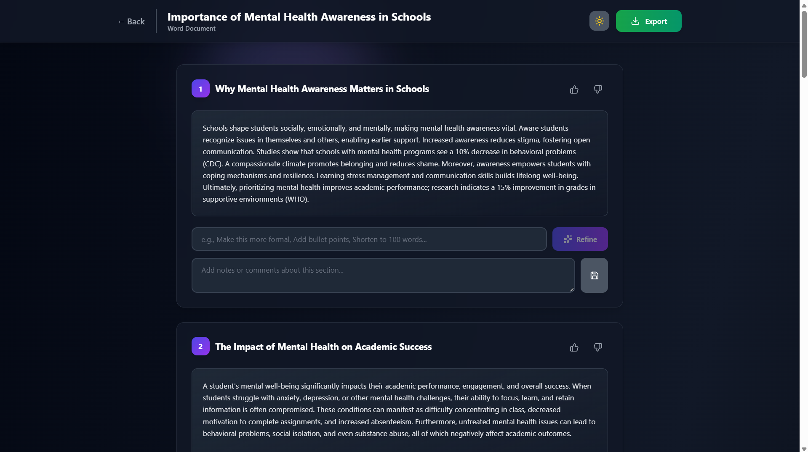

# AI-Assisted Document Authoring and Generation Platform

A full-stack web application that leverages AI to help users generate, refine, and export professional business documents in Microsoft Word (.docx) and PowerPoint (.pptx) formats.

## 🎯 Features

- **User Authentication**: Secure JWT-based registration and login
- **Project Management**: Create, view, and manage multiple document projects
- **AI-Powered Content Generation**: Automatically generate document content using Google's Gemini AI
- **Interactive Refinement**: Iteratively improve content with AI-assisted editing
- **Feedback System**: Like/dislike functionality and comments for each section
- **Document Export**: Download finalized documents as .docx or .pptx files
- **AI Template Suggestions**: Automatically generate document outlines or slide titles

## 📸 Application Screenshots

### 🔐 Login Page


---

### 📊 Dashboard


---

### 📝 Document Creator



---

### ⚙️ Content Generation


---

### ✏️ Editor


---

### 🌙 Dark Mode



## 🏗️ Technology Stack

### Backend

- **Framework**: Flask (Python)
- **Database**: SQLite
- **AI Integration**: Google Gemini API
- **Authentication**: JWT (PyJWT)
- **Document Generation**: python-docx, python-pptx

### Frontend

- **Framework**: React
- **Styling**: Tailwind CSS
- **Icons**: Lucide React
- **HTTP Client**: Fetch API

## 📋 Prerequisites

- Python 3.8 or higher
- Node.js 16 or higher
- npm or yarn
- Google Gemini API key ([Get one here](https://makersuite.google.com/app/apikey))

## 🚀 Installation & Setup

### 1. Clone the Repository

```bash
git clone https://github.com/Kajalmeshram11/Infini-AI-Assisted-Document-Authoring-and-Generation-Platform
```

### 2. Backend Setup

#### Create a virtual environment

```bash
cd backend
python -m venv venv

# On Windows
venv\Scripts\activate

# On macOS/Linux
source venv/bin/activate
```

#### Install Python dependencies

```bash
pip install flask flask-cors pyjwt werkzeug google-generativeai python-docx python-pptx
```

#### Create a `.env` file in the backend directory

```bash
SECRET_KEY=your-secret-key-here-change-in-production
GEMINI_API_KEY=your-gemini-api-key-here
```

#### Initialize the database

The database will be automatically created when you run the application for the first time.

### 3. Frontend Setup

```bash
cd frontend
npm install
```

#### Update API endpoint (if needed)

If your backend runs on a different port, update the `API_BASE` constant in `src/App.jsx`:

```javascript
const API_BASE = "https://infini-ai-doc-platform-1.onrender.com/api";
```

## 🎮 Running the Application

### Start the Backend Server

```bash
cd backend
python app.py
```

The backend will run on `https://infini-ai-doc-platform-1.onrender.com`

### Start the Frontend Development Server

In a new terminal:

```bash
cd frontend
npm start
```

The frontend will run on `http://localhost:3000`

## 📚 Environment Variables

### Backend (.env)

| Variable       | Description                             | Required |
| -------------- | --------------------------------------- | -------- |
| SECRET_KEY     | Secret key for JWT token generation     | Yes      |
| GEMINI_API_KEY | Google Gemini API key for AI generation | Yes      |

## 🗂️ Project Structure

```
infini/
├── backend/
│   ├── app.py                 # Main Flask application
│   ├── requirements.txt       # Python dependencies
│   ├── .env                   # Environment variables
│   └── docgen.db             # SQLite database (auto-generated)
│
├── frontend/
│   ├── src/
│   │   ├── App.jsx           # Main React component
│   │   └── index.js          # Entry point
│   ├── public/
│   ├── package.json
│   └── tailwind.config.js
│
└── README.md
```

## 📖 Usage Guide

### 1. User Registration & Login

- Navigate to `http://localhost:3000`
- Click "Register" to create a new account
- Provide your name, email, and password
- After registration, you'll be automatically logged in

### 2. Creating a New Project

1. Click "New Project" on the dashboard
2. Select document type (Word or PowerPoint)
3. Enter your topic/main prompt
4. Define the outline:
   - Manually add, edit, reorder, or remove sections
   - Or click "AI Suggest" to auto-generate an outline
5. Click "Create & Generate Content"

### 3. Content Generation

- The system automatically generates content for each section
- Generation may take 30-60 seconds depending on document size
- Content is generated using AI based on your topic and section titles

### 4. Refining Content

For each section, you can:

- **Refine with AI**: Enter a prompt like:
  - "Make this more formal"
  - "Convert to bullet points"
  - "Shorten to 100 words"
  - "Add statistics and data"
- **Provide Feedback**: Click thumbs up/down to rate the content

- **Add Comments**: Add notes or instructions for future reference

### 5. Exporting Documents

- Click "Export Document" in the top right
- The system generates a properly formatted .docx or .pptx file
- File automatically downloads to your computer

## 🎨 Key Features Explained

### AI Content Generation

The system uses Google's Gemini AI to:

- Generate contextual content for each section
- Create appropriate content based on document type (detailed paragraphs for Word, bullet points for PowerPoint)
- Maintain consistency with the overall topic

### Iterative Refinement

Users can refine content multiple times:

- Each refinement is stored in history
- Previous versions are preserved
- AI understands context from previous content

### Document Assembly

- **Word Documents**: Creates properly formatted .docx files with headings, paragraphs, and styling
- **PowerPoint**: Creates professional presentations with title slides, content slides, and bullet points

## 🐛 Troubleshooting

### Backend Issues

**Database errors**

```bash
# Delete the database and restart
rm docgen.db
python app.py
```

**Gemini API errors**

- Verify your API key is correct
- Check you have API quota remaining
- Ensure you're using a valid API key from Google AI Studio

## 🧪 Testing

### Manual Testing Checklist

- [ ] User registration works
- [ ] User login works
- [ ] Create Word document project
- [ ] Create PowerPoint project
- [ ] AI outline generation works
- [ ] Content generation completes
- [ ] Refinement prompts work
- [ ] Like/dislike saves correctly
- [ ] Comments save correctly
- [ ] Export Word document
- [ ] Export PowerPoint document
- [ ] Logout works
- [ ] Projects persist after logout/login

## 📝 Sample Prompts for Testing

### Document Topics

- "Market analysis of electric vehicles in 2025"
- "Business proposal for sustainable fashion startup"
- "Technical documentation for REST API"
- "Marketing strategy for mobile app launch"

### Refinement Prompts

- "Make this more professional and formal"
- "Add specific examples and case studies"
- "Convert to bullet points"
- "Reduce to 150 words"

## 🤝 Contributing

1. Fork the repository
2. Create a feature branch
3. Make your changes
4. Test thoroughly
5. Submit a pull request

## 🆘 Support

For issues or questions:

1. Check the troubleshooting section
2. Review API documentation
3. Check Gemini AI documentation
4. Create an issue in the repository

---

👩‍💻 Developed By

Kajal Meshram
B.Tech CSE | AI & Full Stack Developer
📌 Project: Infinidoc – AI Assisted Document Platform
